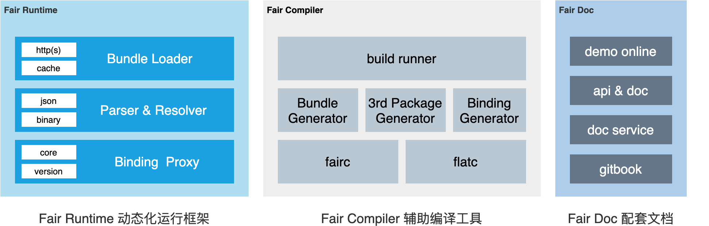

<!-- ALL-CONTRIBUTORS-BADGE:START - Do not remove or modify this section -->
<p align="center">
  <a href="https://pub.dev/packages/fair"></a>
  <a href="https://github.com/wuba/fair"></a>
  <a href="https://fair.58.com/"></a>
  <a href="https://github.com/wuba/fair/LICENSE"></a>
  <a href="https://github.com/wuba/fair/actions"></a>
  <a href="https://gitter.im/flutter_fair/community?utm_source=badge&utm_medium=badge&utm_campaign=pr-badge"></a>
</p>

[简体中文](README-zh.md)|[English](README.md)

---

Fair is a lightweight package for Flutter, which can be used to update widget tree and state dynamically. This package is still at an early stage.

We create Fair so we can dispatch any pages changes to users as bundle(s), the way similar to React Native. With Flutter Fair integrated, you can publish your pages without waiting for the next release date of your App. Fair provides standard widget and some logic plugins, it can be used as a new dynamic page or as part of existing Flutter page.


Fair's UI rendering is lossless and can be restored at the pixel level. Take a look at the effect of escaping some pages of Best Flutter UI Templates:


> The project used is from https://github.com/mitesh77/Best-Flutter-UI-Templates </br>
> location：/example/lib/best_flutter_ui

## 🏛Architecture



## 🚀 Running
Use Flutter Fair require few steps. 

**step1：download fair project source code**

It is recommended to download [fair](https://github.com/wuba/fair) to the local and dependencies on the relative path. 

The download method is as follows:

```
git clone https://github.com/wuba/fair.git
```

**step2：Add dependency inside `pubspec.yaml`**

Assuming that the fair project and your own project are in the same folder:

```yaml
# add Fair dependency
dependencies:
  fair: 2.5.0

# add build_runner and compiler dependency
dev_dependencies:
  build_runner: ^2.0.0
  fair_compiler:
    path: ../fair/compiler
 
# switch "fair_version" according to the local Flutter SDK version
# Flutter SDK 2.8.x(2.8.0、2.8.1) -> flutter_2_8_0
# Flutter SDK 2.5.x(2.5.0、2.5.1、2.5.2、2.5.3) -> flutter_2_5_0
# Flutter SDK 2.0.6 -> flutter_2_0_6
# Flutter SDK 1.22.6 -> flutter_1_22_6
dependency_overrides:
  fair_version:
    path: ../fair/flutter_version/flutter_2_8_0
```

**step3：Wrap your app with FairApp Widget**

```dart
void main() {
  WidgetsFlutterBinding.ensureInitialized();

  FairApp.runApplication(
    _getApp(),
    plugins: {
    },
  );
}

dynamic _getApp() => FairApp(
  modules: {
  },
  delegate: {
  },
  child: MaterialApp(
    home: FairWidget(
            name: 'DynamicWidget',
            path: 'assets/bundle/lib_src_page_dynamic_widget.fair.json',
            data: {"fairProps": json.encode({})}),
  ),
);
```

**step4：Import a dynamic widget as FairWidget**

```dart
FairWidget(
  name: 'DynamicWidget',
  path: 'assets/bundle/lib_src_page_dynamic_widget.fair.json',
  data: {"fairProps": json.encode({})}),
```

## Documentation
For more details, please refer to [https://fair.58.com](https://fair.58.com)

## versions

### 2.6.0
updateDate：2022.07.05

#### Fair
- 1.Fair supports loading bundle files on the phone disk path;
- 2. Adapt to Flutter SDK 2.10.0, 2.10.1, 2.10.2, 2.10.3;
- 3.Dart2JS supports parsing static methods;
- 4. When running, the page error message prompts optimization;
- 5. Syntactic sugar supports parsing Model data.

### 2.5.0
updateDate：2022.05.31
#### Fair
Adapt to flutter SDK 2.8.0, 2.8.1  
Dart2js supports parsing singletons  
New syntax Sugar.switchCase、Sugar.colorsWithOpacity、Sugar.convertToString, etc  
#### example
Comprehensively optimize the example structure and upgrade the example experience, which is more suitable for beginners.  

In the source code, an example project is added to provide the standard usage of fair API.  

example location：`fair/example`

### v2.4.1
updateDate：2022.05.12  

Fix FairLogger import problem.  
Upgrade Analyzer to 2.3.0.  

### v2.4.0
updateDate：2022.04.26

FlatBuffers supports generating bin files in a null safe environment  

### v2.3.0
updateDate: 2022.04.22

#### Fair
supports null-safe  
Adapt to Flutter SDK 2.5.0, 2.5.1, 2.5.2, 2.5.3 and other versions  
#### demo
Upgrade the outdated demo in the sample project  
Supplement the iOS runtime environment in the sample project  

## 🕰2022 Roadmap

* Major release plan
   * null-safe version support, expected to be launched on April 22 ✅
   * Flutter 2.8.0 version adaptation, expected to be launched in mid-May ✅
   * Flutter 2.10.0 version adaptation, is expected to be launched in early June  ✅
   * Flutter 3.0 version adaptation               ✅
   * IDE syntax detection and hint plugin ✅
   * Rich syntactic sugar
* Hot update platform
   * Dart Server project construction ✅
   * Flutter Web project construction ✅
   * Patch/resource management         ✅
   * Project management                ✅
   * Mobile Update&Download           ✅
* Online dynamic
   * Flutter Web project construction ✅
   * Dart Server project construction ✅
   * ActionEdit
   * Code editing                     ✅
   * Component editing
   * Page editing
   * Engineering editor
   * Flutter effect preview
   * Fair DSL preview
* IDE plug-in
   * Fair project generation
   * Fair template generation
   * Fair syntax detection
  
## ✨Contributors

Thanks goes to these wonderful people ([emoji key](https://allcontributors.org/docs/en/emoji-key)):

<!-- ALL-CONTRIBUTORS-LIST:START - Do not remove or modify this section -->
<!-- prettier-ignore-start -->
<!-- markdownlint-disable -->
<table>
  <tr>
    <td align="center"><a href="https://github.com/gongpengyang"><br /><sub><b>gongpengyang</b></sub></a><br /><a href="https://github.com/wuba/fair/commits?author=gongpengyang" title="Code">💻</a></td>
    <td align="center"><a href="https://github.com/XIAOYUAOQISHI"><br /><sub><b>qixu</b></sub></a><br /><a href="https://github.com/wuba/fair/commits?author=XIAOYUAOQISHI" title="Code">💻</a></td>
    <td align="center"><a href="https://yancechen.github.io/"><br /><sub><b>陈有余</b></sub></a><br /><a href="https://github.com/wuba/fair/commits?author=yancechen" title="Code">💻</a></td>
    <td align="center"><a href="https://github.com/yyzl0418"><br /><sub><b>yangyang</b></sub></a><br /><a href="https://github.com/wuba/fair/commits?author=yyzl0418" title="Code">💻</a></td>
    <td align="center"><a href="https://github.com/wanbing"><br /><sub><b>wan</b></sub></a><br /><a href="https://github.com/wuba/fair/commits?author=wanbing" title="Code">💻</a></td>
    <td align="center"><a href="https://github.com/bujiee"><br /><sub><b>bujie</b></sub></a><br /><a href="https://github.com/wuba/fair/commits?author=bujiee" title="Code">💻</a></td>
    <td align="center"><a href="https://github.com/windkc"><br /><sub><b>Kc</b></sub></a><br /><a href="https://github.com/wuba/fair/commits?author=windkc" title="Code">💻</a></td>
    <td align="center"><a href="http://blog.hacktons.cn/"><br /><sub><b>Wu</b></sub></a><br /><a href="https://github.com/wuba/fair/commits?author=avenwu" title="Code">💻</a> <a href="https://github.com/wuba/fair/commits?author=avenwu" title="Documentation">📖</a></td>
  </tr>
  <tr>
    <td align="center"><a href="https://github.com/LinLeyang"><br /><sub><b>Penta</b></sub></a><br /><a href="https://github.com/wuba/fair/commits?author=LinLeyang" title="Code">💻</a> <a href="https://github.com/wuba/fair/commits?author=LinLeyang" title="Documentation">📖</a></td>
    <td align="center"><a href="https://github.com/153493932"><br /><sub><b>haijun</b></sub></a><br /><a href="https://github.com/wuba/fair/commits?author=153493932" title="Code">💻</a> <a href="https://github.com/wuba/fair/commits?author=153493932" title="Documentation">📖</a></td>
    <td align="center"><a href="https://github.com/waynesonic"><br /><sub><b>waynesonic</b></sub></a><br /><a href="https://github.com/wuba/fair/commits?author=waynesonic" title="Code">💻</a></td>
    <td align="center"><a href="https://github.com/paozhuanyinyu"><br /><sub><b>paozhuanyinyu</b></sub></a><br /><a href="https://github.com/wuba/fair/commits?author=paozhuanyinyu" title="Code">💻</a></td>
    <td align="center"><a href="https://github.com/Alzzzz"><br /><sub><b>alzzzz</b></sub></a><br /><a href="https://github.com/wuba/fair/commits?author=Alzzzz" title="Code">💻</a> <a href="https://github.com/wuba/fair/commits?author=Alzzzz" title="Documentation">📖</a></td>
    <td align="center"><a href="https://github.com/xiangwc"><br /><sub><b>xiangwc</b></sub></a><br /><a href="https://github.com/wuba/fair/commits?author=xiangwc" title="Code">💻</a></td>
    <td align="center"><a href="https://github.com/KKProject"><br /><sub><b>WangYk</b></sub></a><br /><a href="https://github.com/wuba/fair/commits?author=KKProject" title="Code">💻</a></td>
    <td align="center"><a href="https://github.com/JunZiJianYi"><br /><sub><b>SunWei</b></sub></a><br /><a href="https://github.com/wuba/fair/commits?author=JunZiJianYi" title="Code">💻</a></td>
  </tr>
  <tr>
    <td align="center"><a href="https://github.com/shanpengtao"><br /><sub><b>单鹏涛</b></sub></a><br /><a href="https://github.com/wuba/fair/commits?author=shanpengtao" title="Code">💻</a></td>
    <td align="center"><a href="https://github.com/lswc225"><br /><sub><b>lswc225</b></sub></a><br /><a href="https://github.com/wuba/fair/commits?author=lswc225" title="Code">💻</a></td>
    <td align="center"><a href="http://www.gaofeiyu.com/"><br /><sub><b>Goofy</b></sub></a><br /><a href="https://github.com/wuba/fair/commits?author=gaofeiyu" title="Code">💻</a></td>
    <td align="center"><a href="https://github.com/itzhaoqian"><br /><sub><b>itzhaoqian</b></sub></a><br /><a href="https://github.com/wuba/fair/commits?author=itzhaoqian" title="Code">💻</a></td>
    <td align="center"><a href="https://github.com/xxliang"><br /><sub><b>Sunlight Xie</b></sub></a><br /><a href="https://github.com/wuba/fair/commits?author=xxliang" title="Code">💻</a></td>
    <td align="center"><a href="https://github.com/a303268287"><br /><sub><b>lhdycxgghb</b></sub></a><br /><a href="https://github.com/wuba/fair/commits?author=a303268287" title="Code">💻</a></td>
  </tr>
</table>

<!-- markdownlint-restore -->
<!-- prettier-ignore-end -->

<!-- ALL-CONTRIBUTORS-LIST:END -->

This project follows the [all-contributors](https://github.com/all-contributors/all-contributors) specification. Contributions of any kind welcome!

## 📱Accessed APPs
<table>
  <tr>
    <td align="center"><br /><sub><b>58阿姨</b></sub><br /></td>
    <td align="center"><br /><sub><b>移动经纪人</b></sub><br /></td>
    <td align="center"><br /><sub><b>安居拍房</b></sub><br /></td>
    <td align="center"><br /><sub><b>神奇保</b></sub><br /></td>
    <td align="center"><br /><sub><b>58商办通</b></sub><br /></td>
    <td align="center"><br /><sub><b>58商家版</b></sub><br /></td>
    <td align="center"><br /><sub><b>中华英才网</b></sub><br /></td>
  </tr>
</table>

## 👏🏻Supporters

[](https://github.com/wuba/fair/stargazers)

[](https://github.com/wuba/fair/network/members)

## License

Copyright (C) 2005-present, 58.com.  All rights reserved.

Redistribution and use in source and binary forms, with or without modification,
are permitted provided that the following conditions are met:

    * Redistributions of source code must retain the above copyright
      notice, this list of conditions and the following disclaimer.
    * Redistributions in binary form must reproduce the above
      copyright notice, this list of conditions and the following
      disclaimer in the documentation and/or other materials provided
      with the distribution.
    * Neither the name of 58.com nor the names of its
      contributors may be used to endorse or promote products derived
      from this software without specific prior written permission.

THIS SOFTWARE IS PROVIDED BY THE COPYRIGHT HOLDERS AND CONTRIBUTORS "AS IS" AND
ANY EXPRESS OR IMPLIED WARRANTIES, INCLUDING, BUT NOT LIMITED TO, THE IMPLIED
WARRANTIES OF MERCHANTABILITY AND FITNESS FOR A PARTICULAR PURPOSE ARE
DISCLAIMED. IN NO EVENT SHALL THE COPYRIGHT OWNER OR CONTRIBUTORS BE LIABLE FOR
ANY DIRECT, INDIRECT, INCIDENTAL, SPECIAL, EXEMPLARY, OR CONSEQUENTIAL DAMAGES
(INCLUDING, BUT NOT LIMITED TO, PROCUREMENT OF SUBSTITUTE GOODS OR SERVICES;
LOSS OF USE, DATA, OR PROFITS; OR BUSINESS INTERRUPTION) HOWEVER CAUSED AND ON
ANY THEORY OF LIABILITY, WHETHER IN CONTRACT, STRICT LIABILITY, OR TORT
(INCLUDING NEGLIGENCE OR OTHERWISE) ARISING IN ANY WAY OUT OF THE USE OF THIS
SOFTWARE, EVEN IF ADVISED OF THE POSSIBILITY OF SUCH DAMAGE.