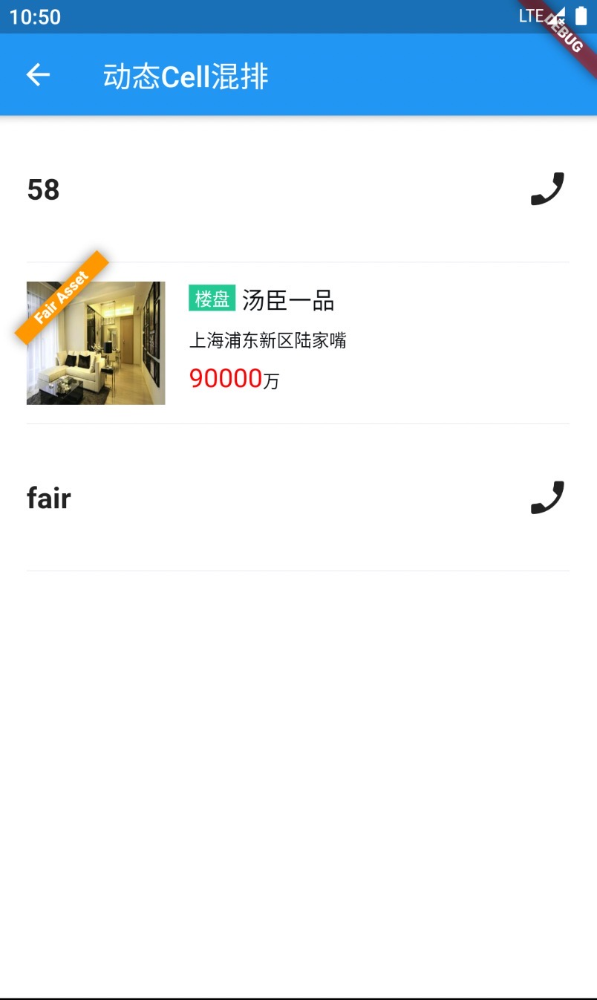

# 原生列表内，动态Cell与原生Cell混排

## 使用场景
    在原生列表中，当我们需要对一个卡片或者一块内容做动态的展示时使用。
    例如：面对API简单控制展示无法满足的情况下，对一块内容做整体UI调整时，可以通过隐藏原有内容，替换成动态的Cell来实现目标。

## 预览效果

## 集成方式

    整体设计采用组合的方式，开发者只需要在需要支持动态化Cell的列表中，预埋动态类型的Cell。如下的item.type == 'fair'（如果列表内容后端下发，需要提前跟后端沟通动态类型） 标识一个动态类型。

    Widget getItem(var item) {
        if (item.type == 'fair') { // 动态Cell
          // 动态化Cell
          return Container( // 占位容器
              alignment: Alignment.centerLeft,
              color: Colors.white,
              constraints: BoxConstraints(minHeight: 80),
              child: FairWidget(
                name: id, // Cell 唯一id
                path: 'assets/bundle/lib_src_page_list_cells_sample_page_stateful_cell.fair.bin', // http 线上或者本地差分包
                data: {"fairProps": json.encode(louPanDetail)}, // 传递给Cell的动态内容
              ));
        }
    }

