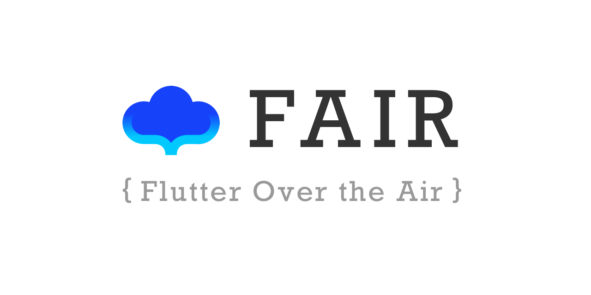
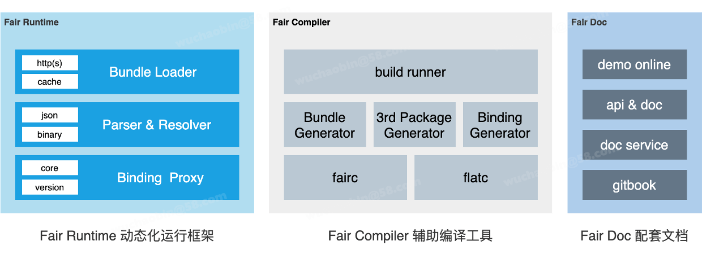

# 介绍

Fair是为Flutter设计的，轻量级动态化框架。目前处于早期阶段，主要用于Flutter布局的动态化。

创建Fair的目标是支持不发版（Android、iOS、Web）的情况下，通过业务bundle下发实现更新，方式类似于React Native。与Flutter Fair集成后，您可以快速发布新的的UI页面，而无需等待应用的下一个发布日期。Fair提供了标准的Widget，它可以被用作一个新的动态页面或作为现有Flutter页面的一部分，诸如运营位的排版/样式修改，整页面替换，局部替换等都可以使用。

> 感谢UXD的**Kaibin**老师提供设计支持

## 框架结构

## Flutter Fair是...?
- Fair是Flutter over the air的缩写。
::: tip Fair翻译
treating someone in a way that is right or reasonable, or treating a group of people equally and not allowing personal opinions to influence your judgment

合理的；公平的；公正的；平等待人的
:::

- Fair是一个开源的动态化框架

::: tip 为什么开源？

动态化处于早期阶段，社区缺轮子。开源可以吸纳社区的意见建议，有利于项目本身的持续完善；当然也可以给更多开发人员作参考之用。
:::

- Fair是一个技术驱动的兼职项目
::: tip 自由与兼职
从项目设计，协同开发，产出，都是有技术主导。所有参与人员都是兼职形式加入，在实践上我们得到了领导的支持，Fair后续维护也将继续以兼职的形式存在。
:::

## Flutter Fair不是...?

* Flutter热更新

通常热更新包括APP的逻辑更新，Fair当前定位是布局动态化，暂不支持动态下发逻辑运算，对逻辑的支持，需要提前内置封装为逻辑组件(好比为Hybrid、RN体系中跟版迭代的Module与Action)。

* MXFlutter

mxflutter是基于JavaScript 的Flutter框架。如果采用js技术栈开发flutter，推荐尝试[https://github.com/mxflutter/mxflutter](https://github.com/mxflutter/mxflutter)

## Demo效果
Fair附带了一些社区demo转为fair动态化形式，工程位于samples目录下，以下预览视频为转义了部分[Best-Flutter-UI-Templates](https://github.com/mitesh77/Best-Flutter-UI-Templates)页面。

<video width="360" height="auto" loop="loop" controls="" preload="none">
  <source src="/bestui.mp4" type="video/mp4">
  您的浏览器不支持 video 标签。
</video>

## 交流群
对Fair感兴趣的小伙伴，可以加入交流群。

| 微信                         | 美事（内部）                 |
| ---------------------------- | ---------------------------- |
|  |  |