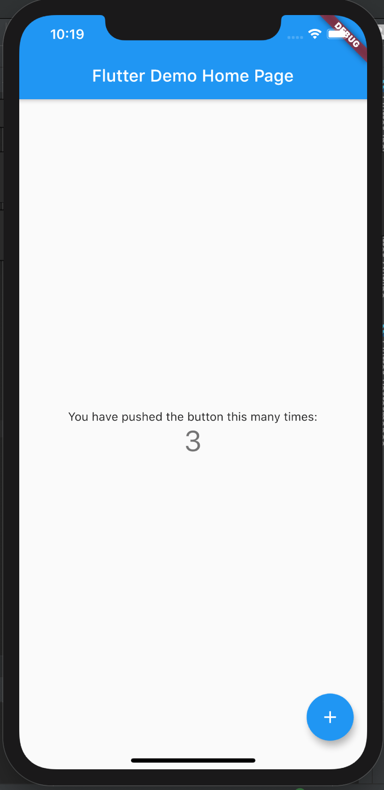

# Counting计数器
学习很多语言的时候都有hello world，在Flutter里面他的Hello World是个counting计数器。下面我们把这个计数器转换为Flutter Fair。

counting工程是模板工程，只需要利用flutter create就可以创建。不同版本可能会略有差异，但是差不太多。核心内容如下：
* 一个文本标签，展示计数值
* 一个按钮，更新计数


## 预览效果
|   Flutter   |    Fair  |
| ---- | ---- |
|      |      |

## Dart源码
参考源码：
* main.dart

```dart
import 'package:fair/fair.dart';
import 'package:flutter/material.dart';

void main() {
  runApp(MyApp());
}

class MyApp extends StatelessWidget {
  @override
  Widget build(BuildContext context) {
    return MaterialApp(
      title: 'Flutter Demo',
      theme: ThemeData(
        primarySwatch: Colors.blue,
        visualDensity: VisualDensity.adaptivePlatformDensity,
      ),
      home: MyHomePage(title: 'Flutter Demo Home Page'),
    );
  }
}

class MyHomePage extends StatefulWidget {
  MyHomePage({Key key, this.title}) : super(key: key);
  final String title;

  @override
  _MyHomePageState createState() => _MyHomePageState();
}

class _MyHomePageState extends State<MyHomePage> {
  int _counter = 0;

  void _incrementCounter() {
    setState(() {
      _counter++;
    });
  }

  @override
  Widget build(BuildContext context) {
    return Scaffold(
      appBar: AppBar(
        title: Text(widget.title),
      ),
      body: Center(
        child: Column(
          mainAxisAlignment: MainAxisAlignment.center,
          children: <Widget>[
            Text(
              'You have pushed the button this many times:',
            ),
            Text(
              '$_counter',
              style: Theme.of(context).textTheme.headline4,
            ),
          ],
        ),
      ),
      floatingActionButton: FloatingActionButton(
        onPressed: _incrementCounter,
        tooltip: 'Increment',
        child: Icon(Icons.add),
      ), // This trailing comma makes auto-formatting nicer for build methods.
    );
  }
}
```

## Fair改造

### main.dart

#### 修改main方法和引用

```dart
import 'dart:convert';
import 'package:fair/fair.dart';
import 'package:flutter/material.dart';

void main() {
    WidgetsFlutterBinding.ensureInitialized();

    FairApp.runApplication(
        _getApp(),
        plugins: {},
    );
    // runApp(MyApp());
}
```

#### 对接原方法

```dart

dynamic _getApp() => FairApp(
  modules: {},
  delegate: {},
  child: MyApp(),
);

```

#### 替换Home入口

```dart
class MyApp extends StatelessWidget {
  // This widget is the root of your application.
  @override
  Widget build(BuildContext context) {
    return MaterialApp(
            title: 'Flutter Demo',
            theme: ThemeData(
              primarySwatch: Colors.blue,
              visualDensity: VisualDensity.adaptivePlatformDensity,
            ),
            // home: MyHomePage(data: {'title': 'Flutter Demo Home Page'}));
            home: FairWidget(
                    name: '58 Fair',
                    path: 'assets/bundle/lib_main.fair.json',
                    data: {
                      'fairProps': jsonEncode({'title': '58 Fair'})
                    }));
  }
}

```

#### 改造原始界面
```dart
@FairPatch()
class MyHomePage extends StatefulWidget {
  
  MyHomePage({Key key, this.data}) : super(key: key) {
    title = data['title'];
  }

  String title;
  dynamic data;

  @override
  _MyHomePageState createState() => _MyHomePageState();
}

class _MyHomePageState extends State<MyHomePage> {
  
  // 定义与JS侧传递的参数，只能传递一个Map类型
  @FairProps()
  var fairProps;

  int _counter = 0;
  var _title;

  // JS生命周期方法--在JS加载完成自动调用
  void onLoad() {
    _title = fairProps['title'];
  }

  @override
  void initState() {
    super.initState();
    // 此处fairProps需要在onLoad 外部赋值，JS中会自动赋值
    fairProps = widget.data;
    onLoad();
  }

  void _incrementCounter() {
    setState(() {
      _counter++;
    });
  }

  @override
  Widget build(BuildContext context) {
    return Scaffold(
      appBar: AppBar(
        title: Text(_title),
      ),
      body: Center(
        child: Column(
          mainAxisAlignment: MainAxisAlignment.center,
          children: <Widget>[
            Text(
              'You have pushed the button this many times:',
            ),
            Text(
              '$_counter',
              // 暂不支持 style: Theme.of(context).textTheme.headline4,
              // 可替换成:
              style: TextStyle(fontSize: 40, color: Color(0xffeb4237), wordSpacing: 0),
            ),
          ],
        ),
      ),
      floatingActionButton: FloatingActionButton(
        onPressed: _incrementCounter,
        tooltip: 'Increment',
        child: Icon(Icons.add),
      ), // This trailing comma makes auto-formatting nicer for build methods.
    );
  }
}
```
