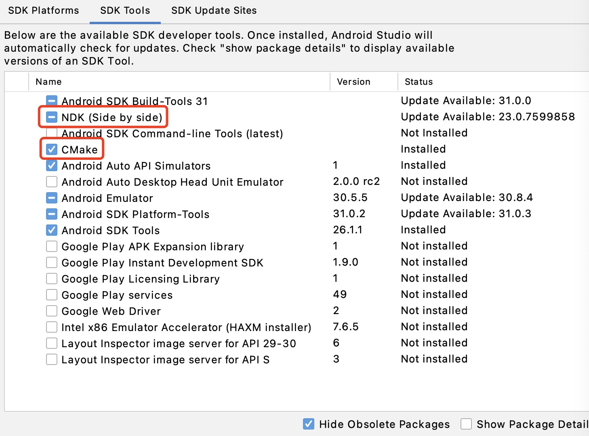
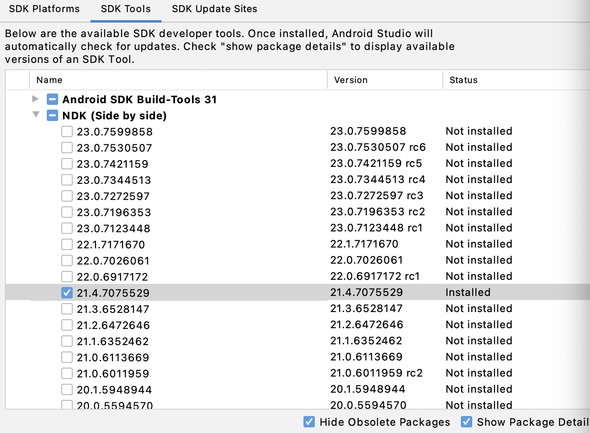

# 准备开发环境
构建 Fair 需要安装特定的工具，每个平台的安装方式都不太一样。

## macOS 环境准备

### 安装 Flutter

  git clone https://github.com/flutter/flutter

###  切换到 Fair 指定的 Flutter 版本

  git checkout <flutter_version>

### 按照 Flutter 官方文档 的步骤安装 Flutter 的相关依赖, 确保执行 flutter doctor 不再有任何警告。

### 安装 CMake & NDK
建议通过Android Studio安装！
#### CMake安装

#### NDK安装

## Windows 环境准备
（验证中）
## Linux 环境准备
（验证中）
