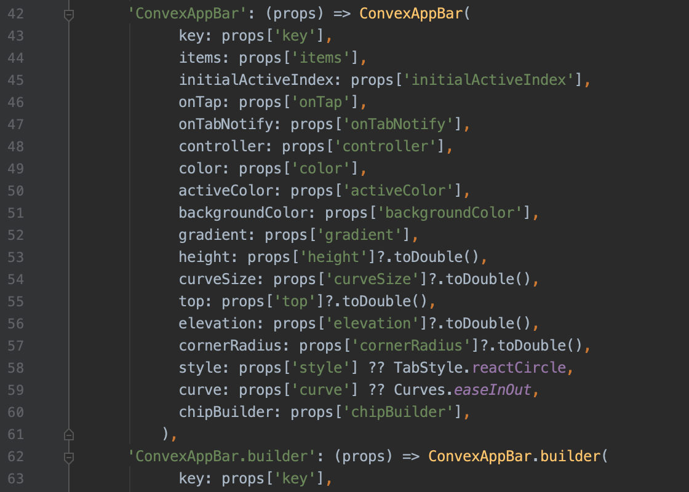

# 编写组件映射表

通过编写组件映射表，Fair可以支持更多的Widget，既可以是Flutter框架的，也可以是三方组件。

## 手工编写
执行`createBinding`创建Binding对象，用于注册：

```dart
FairApp(
  manual: createBinding(
    widget: {
        "MyWidget": CustomTag(key: props['key'], text: props['text']),
    },
  ),
));

// 自定义组件
class CustomTag extends StatelessWidget {
  final String text;

  const CustomTag({Key key, this.text}) : super(key: key);

  @override
  Widget build(BuildContext context) {
    return Text(text);
  }
}
```
然后在DSL中可以使用：
```json
{
  "className": "CustomTag",
  "na":{ "text":" Hello World"}
}
```

## 自动生成
如果组件比较多，或者构造比较复杂，手写的效率较低。可以使用`@FairBinding()`注解为你自动生成代码。

首先为组件添加好注解
```dart
import 'package:fair/fair.dart';
import 'package:flutter/widgets.dart';

@FairBinding()
class CustomTag extends StatelessWidget {
  final String text;

  const CustomTag({Key key, this.text}) : super(key: key);

  @override
  Widget build(BuildContext context) {
    return Text(text);
  }
}
```

接着执行
```shell
flutter pub run build_runner build
```

生成代码位于src/generated.fair.dart内；

最后绑定自动生成的代码。
```dart
import 'src/generated.fair.dart' as g;

FairApp(
  generated: g.p(),
));
```

## 为三方组件
在实际开发中，我们会使用很多三方的Widget，如何为他们生成组件呢？  
最直接的办法是按需手工编写，也可以借助我们的框架自动生成。

在FairBinding注解上绑定三方组件的package路径，此时，Fair在为组件生成映射表时，也可以同步生成绑定的三方组件映射。

例如我们为convex_bottom_bar生成组件表：

```
@FairBinding(resource: 'package:convex_bottom_bar/src/bar.dart',)
class VideoCard extends StatelessWidget {
}
```


