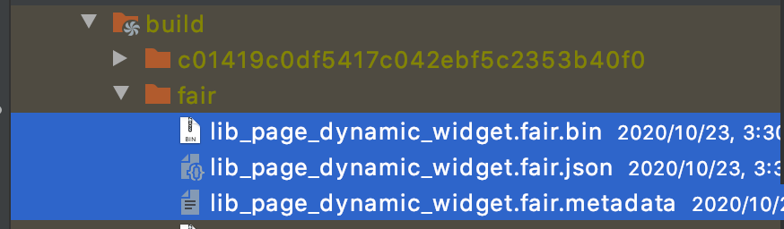
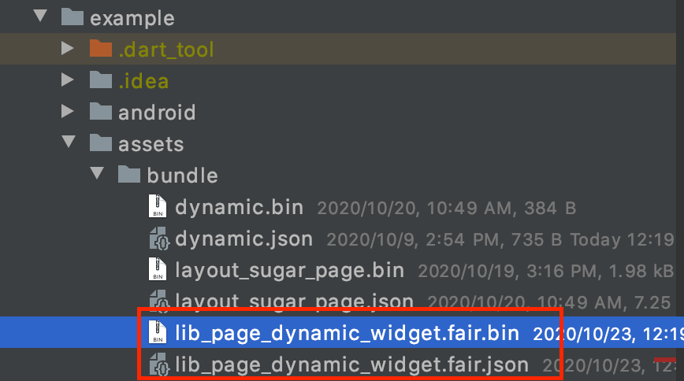
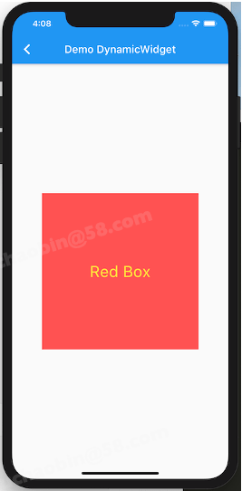
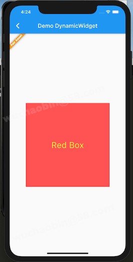

# 从零开始写一个Demo

在Fair接入完成后，我们需要一个bundle才能更显示动态页面，那么怎么编写bundle呢？

这一节我们继续基于Counting Demo做示例，逐步将Demo做一些复杂调整。

## 1. 增加逻辑方法

首先我们写一个在build内部，通过逻辑判断替换Fair Logo的功能。

下面的代码完全使用flutter编写，这样的好处是源代码可以无缝在原生和动态之间切换。
Demo的入参是一个文本和一个数字。

```dart
class IfEqualBoolPage extends StatefulWidget {
  var fairProps;

  IfEqualBoolPage(dynamic data) {
    fairProps = data;
  }

  @override
  State<StatefulWidget> createState() {
    return _State();
  }
}

class _State extends State<IfEqualBoolPage> {
  
  @FairProps()
  var fairProps;

  String _title;
  int _count;

  // JS生命周期方法--在JS加载完成自动调用
  void onLoad() {
    _title = fairProps['pageName'];
    _count = fairProps['count'];
  }
  
  void onTapText() {
    _count = _count + 1;
    setState(() {});
  }

  // 逻辑方法
  bool _countCanMod2() {
    return _count % 2 == 1;
  }

  @override
  void initState() {
    super.initState();
    fairProps = widget.fairProps;
    onLoad();
  }

  @override
  Widget build(BuildContext context) {
    return Scaffold(
      appBar: AppBar(
        title: Text(_title),
      ),
      body: Center(
        child: Column(
          mainAxisAlignment: MainAxisAlignment.center,
          children: [
            // Sugar.ifEqualBool 为逻辑和布局混编场景下的语法糖
            Sugar.ifEqualBool(_countCanMod2(),
                falseValue: Image.asset('assets/image/logo.png'),
                trueValue: Image.asset('assets/image/logo2.png')),
            Padding(
              padding: EdgeInsets.only(top: 20),
              child: Text('_count = $_count'),
            ),
            Padding(
              padding: EdgeInsets.only(top: 20),
              child: Text('if _count % 2 == 1,  update image !'),
            ),
          ],
        ),
      ),
      floatingActionButton: Row(
        mainAxisAlignment: MainAxisAlignment.end,
        children: [
          FloatingActionButton(
            child: Icon(Icons.threesixty),
            onPressed: onTapText,
          )
        ],
      ),
    );
  }
}
```


## 2. 动态化展示

现在我们把它转换为Fair能够动态处理的bundle。

第一步：添加注解：

* @FairPatch() 修饰组件的定义，必须是顶级class

```dart
// 修饰当前页面为一个动态bundle资源,只需添加@FairPatch()

@FairPatch()
class IfEqualBoolPage

```

第二步：现在然我们生成bundle吧

> flutter pub run build_runner build

编译成功后，在build/fair目录下找到同名bundle资源:

* .fair.bin 格式为release产物
* .fair.json 格式为debug产物
* .fair.metadata 格式为元数据，标记了源码与产物的关联信息
* .fair.js 格式为逻辑转换为JS后的产物



第三步：复制产物并使用

现在我们可以把资源拷贝出来，放到assets下（别忘了先在yaml中配置assets目录/路径）



第四步：预埋入口

    routes: {
        'fair_page': (context) => FairWidget(
            name: _getParams(context, 'name'),
            path: _getParams(context, 'path'),
            data: {
                'fairProps': jsonEncode(
                _getData(context, _getParams(context, 'name')))
            }),
    },

第五步：调用展示

    Navigator.pushNamed(context, 'fair_page',
                  arguments: {'name': 'ifEqualBool', 'path': 'assets/bundle/lib_src_page_sugers_ifequalbool_page.fair.json', 'data': {'pageName': 'ifEqualBool'，'count': 58}});


重新运行app后，可以看到新的效果，前后效果是像素级别一模一样的。同一份代码，可以原生和动态无缝切换使用。

| Flutter源码效果                              | Fair 动态效果                                |
| -------------------------------------------- | -------------------------------------------- |
|  |  |

## 3. 让功能复杂一些

现在我们希望把build内的布局做一些拆分，封装一些布局子方法

具体改动如下：

* 把Text(_title) 封装成子方法，再调用

```dart
class _State extends State<IfEqualBoolPage> {
  @FairProps()
  var fairProps;

  int _count = 0;

  String getTitle() {
    return fairProps['pageName'];
  }

  void onTapText() {
    _count = _count + 1;
    setState(() {});
  }

  bool _countCanMod2() {
    return _count % 2 == 1;
  }

  // 示例修改点
  Widget _buildTitle() {
    return Text(getTitle());
  }

  @override
  void initState() {
    super.initState();
    fairProps = widget.fairProps;
  }

  @override
  Widget build(BuildContext context) {
    return Scaffold(
      appBar: AppBar(
        title: _buildTitle(), //示例修改点
      ),
      body: Center(
        child: Column(
          mainAxisAlignment: MainAxisAlignment.center,
          children: [
            Sugar.ifEqualBool(_countCanMod2(),
                falseValue: Image.asset('assets/image/logo.png'),
                trueValue: Image.asset('assets/image/logo2.png')),
            Padding(
              padding: EdgeInsets.only(top: 20),
              child: Text('_count = $_count'),
            ),
            Padding(
              padding: EdgeInsets.only(top: 20),
              child: Text('if _count % 2 == 1,  update image !'),
            ),
          ],
        ),
      ),
      floatingActionButton: Row(
        mainAxisAlignment: MainAxisAlignment.end,
        children: [
          FloatingActionButton(
            child: Icon(Icons.threesixty),
            onPressed: onTapText,
          )
        ],
      ),
    );
  }
}
```


编写完代码后，重新生成bundle，app加载新的资源即可。


| 第一版效果                                   | Fair 动态效果                                |
| -------------------------------------------- | -------------------------------------------- |
|  |  |

如果你有服务器，可以把资源托管上去，比如

```dart
FairWidget(
  path:'http://a.b.c/xxx/hello.json',
  name: 'sample_list_view'
)
```

